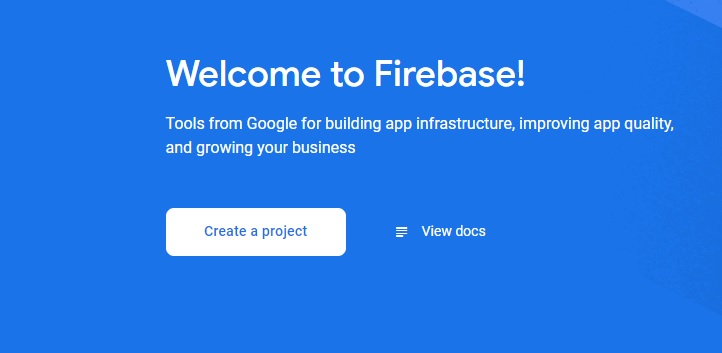
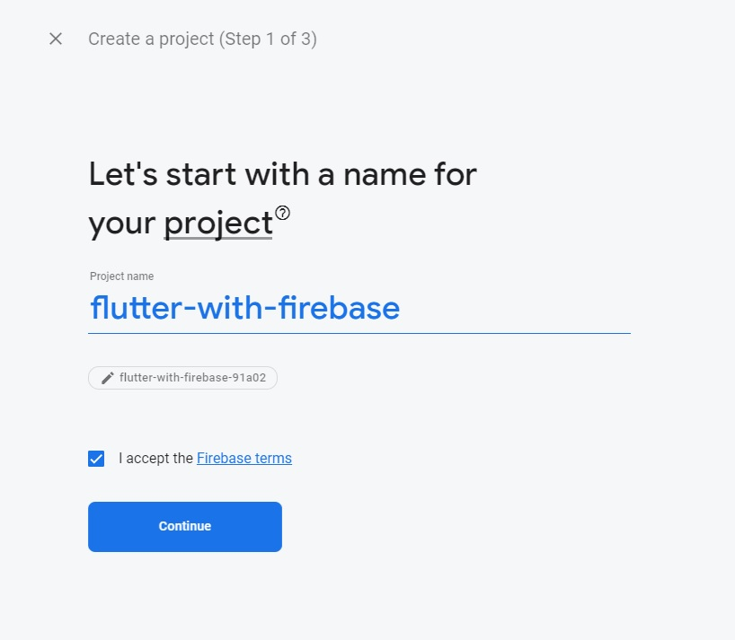
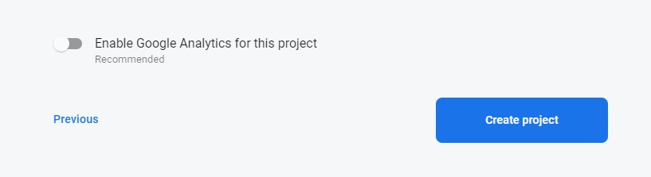

# flutter_with_firebase

### Create a flutter project  

### Create a project in firebase console  

Go to https://firebase.google.com/  

Click on Go to console

Create a firebase project

Name your project

For the time being we will disable google analytics

